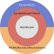

  [](https://pymecht.readthedocs.io/en/latest/?badge=latest)   [](https://joss.theoj.org/papers/9e6d337614f479fa681d57bff102ff71)

# pyMechT

pyMechT is a <u>Py</u>thon package for simulating the <u>mech</u>anical response of soft biological <u>t</u>issues. The ethos of pyMechT is to create simplified virtual experimental setups, rather than finite element analyses. Thus, varying parameters and running simulations is much faster, making it feasible to perform Bayesian inference and Markov Chain Monte Carlo analyses. A short overview is provided in the video below.

[](https://youtu.be/-o-RiiRIEgo?si=owEADuw6tZ8YoHXO)

# Documentation

Find the full documentation at https://pymecht.readthedocs.io/en/latest/.

# Structure

pyMechT is a collection of modules for:

*   `MatModel`: defining material models
*   `SampleExperiment`: simulating experiments, such as uniaxial extension, biaxial extension, and inflation-extension. Simulations can be either `disp_controlled` or `force_controlled`
*   `ParamDict`: a custom dictionary class of a datastructure called `Param`, which facilitates storing/varying/fitting parameters 
*   `ParamFitter`: fitting parameters to experimental data
*   `RandomParameters` and `MCMC`: Bayesian inference by running Monte Carlo (MC) and Markov chain Monte Carlo (MCMC) simulations



This package is developed and maintained by the [Computational Biomechanics Research Group](https://userweb.eng.gla.ac.uk/ankush.aggarwal/) at the University of Glasgow.

Required dependencies are:
* matplotlib
* numpy
* pandas
* pyDOE
* scipy
* torch
* sympy
* tqdm

# Installation

### *Step 1 (optional): Create a virtual environment*

To create an environment in Anaconda, execute:
```sh
conda create -n pymecht python=3.9 ipykernel
```
Python3.9 is suggested, although any of the currently-supported versions of Python will also work.

To activate this virtual environment, execute:
```sh
conda activate pymecht
```
This is an optional, but recommended, step. There are other options for creating and managing environments (such as venv or virtualenv)

### *Step 2: Install via pip*

<details>
<summary>User</summary>

pyMechT can be installed directly from PyPI via pip by using:
```sh
pip install pymecht
```

</details>

<details>
<summary>Developer</summary>
To install as a devloper, it is recommended to fork from the repo and clone this fork locally.

### *Step 2.1 Fork from ankushaggarwal/pymecht*
To fork a branch, head to the [Github repository](https://github.com/ankushaggarwal/pymecht) and click the fork button in the top right-hand corner.
### *Step 2.2 Clone the forked repo*
To clone this repo locally, use the
```sh
git clone <repo-address>
```
where `<repo-address>` can be replaced by either the https or ssh addresses of the forked repo.

### *Step 2.3 Install developer version of pyMechT*
To install a developer version of pyMechT, navigate to the locally cloned repo and execute:
```sh
pip install -e .
```
An editable version of pyMechT is now installed. All local changes to the cloned source code files will be reflected when pyMechT is imported.

</details>

### *Step 3: Check installation*

Ensure that pyMechT has been installed by executing:
```sh
pip list
```
The package and version should be visible in the resulting list.

# Contributing to pyMechT

See the contributing guidelines [CONTRIBUTING.md](https://github.com/ankushaggarwal/pymecht/blob/master/CONTRIBUTING.md)
for information on submitting issues and pull requests.
