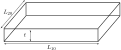

===============================================
PlanarBiaxialExtension and LayeredPlanarBiaxial
===============================================

We consider a planar tissue sample in the :math:`xy` plane (i.e., the
third coordinate direction is along the small tissue thickness). The
sample has reference dimensions :math:`L_{10}`, :math:`L_{20}`, and
:math:`t` along the coordinates 1, 2, and 3, respectively. Furthermore,
we assume that the material is incompressible. Thus, the deformation
gradient is:

.. math:: \mathbf{F} = \mathop{\mathrm{diag}}\left[\lambda_1,\lambda_2,\frac{1}{\lambda_1\lambda_2}\right].

The first two directions are in the tissue’s plane, and the third
direction stress will be zero. Hence, we can calculate :math:`p` by
equating :math:`\sigma_{33}=0`.

If :math:`\boldsymbol{M}=\left[\cos(\theta),\sin(\theta),0 \right]` lies
in :math:`1-2` plane (i.e., planar), then the third term does not
produce stress in the third direction. However, it may produce shear
stress in :math:`1-2` plane (if the fibers are not symmetric about the
first axis). The shear stress components are neglected when returning
the force measure, which can be either the first two diagonal components
of the stress tensor (Cauchy, 1st PK, or 2nd PK), membrane tension in
the two directions (calculated as :math:`P_{11}t` and :math:`P_{22}t`),
or forces in the two directions (calculated as :math:`P_{11}L_{20}t` and
:math:`P_{22}L_{10}t`).

From the two stretches, other deformation metrics can be calculated.
Deformed length :math:`l_\alpha=\lambda_\alpha L_{\alpha0}`, change in
length :math:`\Delta l_\alpha = (\lambda_\alpha-1)L_{l_\alpha 0}`, and
strain :math:`\epsilon_\alpha = (\lambda_\alpha-1)`. Given deformation
(in terms of stretch/change in length, strain, or deformed length), the
force measure can be calculated using disp_controlled function.
Conversely, given stress or force, any of the deformation metric are
solved iteratively.

PlanarBiaxialExtension samples can be “layered” via
LayeredPlanarBiaxial. Such a setup can be used for representing, for
example, tissues that have multiple layers with different material
models and possibly even different reference lengths. The result would
be that there is no zero stress state for the layered sample. One has to
be careful with the inputs and outputs of the layered samples though. It
is required to use lengths (rather than stretches or strains) as the
deformation metric. Similarly, the force measure should not be stresses
since the stresses would not simply add up (instead they would be
weighted by each layer’s thickness).
