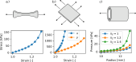

# Summary
 
`pyMechT` aims to fill an important gap for simulating simplified models in soft tissue mechanics, such as for ex-vivo testing protocols. Instead of setting up a detailed finite element simulation, which can be time-consuming and an overkill for certain scenarios, `pyMechT` allows one to setup and run simulations extremely quickly. Moreover, the Python package makes it straightforward to perform parameter estimation and Bayesian inference. Its unique capabilities include incorporating layered structure of tissues and residual stresses.

# Statement of need

Mechanics of soft tissues plays an important role in several physiological problems, including cardio-vascular and musculoskeletal systems. Common ex-vivo biomechanical testing protocols used to characterize tissues include uniaxial extension for one-dimensional structures, such as tendons and ligaments, biaxial extension for planar tissues, such as heart valves and skin, and inflation-extension for tubular tissue structures, such as blood vessels (Figure \ref{ex-vivo-protocols}). These experiments aim to induce a uniform deformation that can be easily related to the generated stresses. 

While several finite element analysis packages are available for performing biomechanical simulation, these are generally intended for more complex scenarios with non-uniform/non-affine deformations. For simulating the ex-vivo experiments, which induce close-to-uniform deformations, in-house codes are commonly developed. However, absence of a common framework can lead to lack of consistency and reproducibility. Moreover, advanced analyses require statistical approaches, such as Monte Carlo simulations and Bayesian inference. To fill this gap, we have developed the open-source Python package `pyMechT`.

# Structure

The package is implemented in Python using an object-oriented structure. The package builds up on widely-used Python libraries: NumPy, SciPy, Pandas, Matplotlib, and PyTorch. `pyMechT` consists of four main modules (see Figure \ref{fig:overview}): 1) `MatModel` for defining constitutive models for materials, 2) `SampleExperiment` for simulating ex-vivo uniaxial/biaxial/inflation-extension experiments, 3) `ParamFitter` for performing parameter estimation based on experimental data, and 4) `MCMC`/`RandomParameters` for performing Bayesian inference using Monte Carlo (MC) or Markov Chain Monte Carlo (MCMC) simulations. Currently, there are eighteen material models implemented in `MatModel`, including fourteen analytical hyperelastic models, two data-based hyperelastic models, one structural model. In addition, an arbitrary hyperelastic model is also implemented, where a user-defined form of the free energy functional is automatically implemented based on symbolic differentiation. 

{height="1 inch"}

A particular focus is on parameters, for which a custom dictionary has been implemented named `ParamDict`. This dictionary facilitates handling large number of parameters via string-based identifiers, and stores lower/upper bounds, fixed/variable flags, in addition to the current parameter values. The dictionary can also be saved/read as csv files. An example set of parameters is shown in Table \ref{table:params} below.

| Keys              | Value      | Fixed?     | Lower bound  | Upper bound    |
| :---------------: | :---------:| :---------:| :---------:  | :---------:    | 
| mu_0              | 100        | No         | 0.01         | 500            |
| L10               | 0.3        | No         | 0.1          | 0.5            |
| L20               | 1.0        | No         | 0.1          | 2.0            |
| thick             | 0.05       | Yes        | -            | -              |
| phi               | 50         | No         | 0            | 90             |

: Example set of parameters saved as `ParamDict` object \label{table:params}

# Documentation and examples
Detailed documentation has been created and is hosted on [`readthedocs`](https://pymecht.readthedocs.io/en/latest/index.html). The documentation starts with an overview of the package, and leads to a basic tutorial that helps one getting started and briefly demonstrates all of the essential features. Additionally, eleven examples have been provided to illustrate all the features and options available in `pyMechT`. These include the unique features of modeling layered structures with different reference dimensions, which is commonly encountered in biological soft tissues. Simulating such a model with any finite element software would be non-trivial. Then, theoretical background of the implemented models is provided, before ending with a package reference automatically generated using `Sphinx`. 

# Advantages over finite element simulation
In principle, the problems that can be solved using `pyMechT` can also be solved using any finite element simulation software. However, `pyMechT` offers the following advantages:

- Geometry and mesh creation would be required for a finite element simulation, which usually takes some time. However, the pre-defined geometrical features in `pyMechT` means that one only needs to choose the right class and parameters. And no meshing is required. This means that setting up the problem is much faster.

- Enforcing incompressibility in a finite element simulation can be numerically challenging, thus requiring one to use approaches such as Lagrange multiplier with a three-field formulation. Instead, in `pyMechT`, the incompressibility is analytically enforced *exactly*, thus making the results more robust.

- The fast nature of simulations in `pyMechT` makes it feasible to run of the order to 10^5^ simulations in several minutes, thus facilitating Monte Carlo and Bayesian inference.

- The reference zero-stress state of biological tissues can be unknown or ambiguous. Moreover, the biological tissues are heterogeneous, with multiple layers each of varying properties. These aspects are non-trivial to incorporate in a finite element simulation, due to the need for recreating the geometry and/or incompatability at the starting step. However, it is straightforward to simulate these in `pyMechT`.

# Uses in literature
`pyMechT` has been used for Bayesian model selection based on extensive planar biaxial extension data [@AGGARWAL2023105657]. This work required rapid simulation of varied constitutive models, which was facilitated by `pyMechT`. Similarly, the Bayesian inference via Markov Chain Monte Carlo in `pyMechT` was used to infer the distribution of aortic biomechanical and geometrical properties based on in-vivo measurements (as likelihood) and ex-vivo biaxial extension data (as prior distribution) [@AGGARWAL2024]. Moreover, data-driven model developed in [@AGGARWAL2023115812] has also been subsequently used in `pyMechT` via the `splineI1` and `splineI1I4` material models. 

# Conclusion and future plans
In conclusion, `pyMechT` fills an important gap and allows soft tissue biomechanics researchers to model ex-vivo testing setups in a fast, robust, and flexible manner. The package is numerically efficient and extensively documented. It has facilitated a few publications in our research group, and we hope that it can benefit the wider community. In the future, we plan to extend the capabilities of the package to include more material models, such as inelastic (viscoelastic, plastic, damage, growth & remodeling), and other ex-vivo setups (such as microindentation). Lastly, the package could be coupled with others to allow multi-physics simulations, such as for hemodynamics and biochemical regulation.

# References
